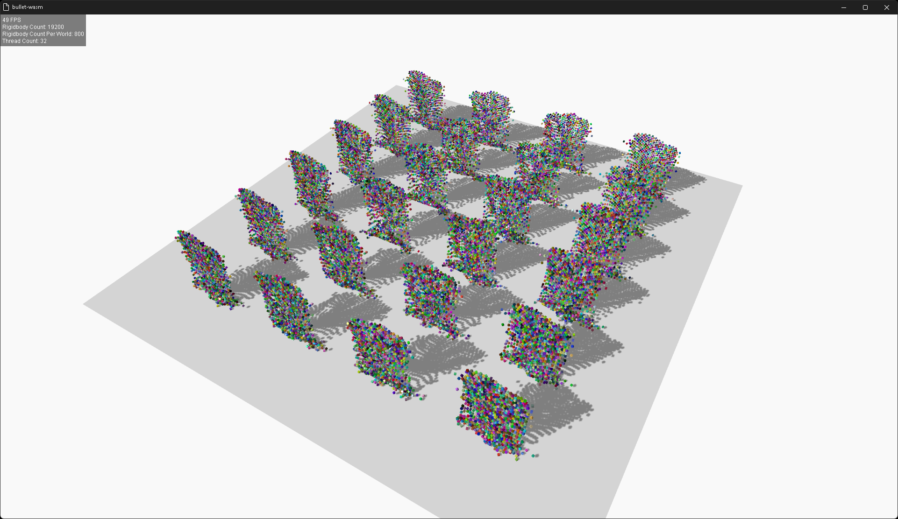
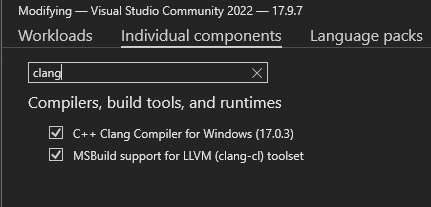

# bullet-rust-wasm

Experimental project to compile Bullet Physics to WebAssembly for rust wasm projects.


*demonstrating 19,200 rigid bodies simulated in real-time using bullet physics in a browser environment*

# [Live Demo](https://bullet-rust-wasm.netlify.app/)

## Overview

**bullet physics is written in C++** and uses many stdlib features in its codebase.

However, **in order to link C++ libraries when building rust** as a browser web-assembly target, **the C++ libraries must be built without using stdlib**.
for more information, see [this stackoverflow question](https://stackoverflow.com/questions/73604042/compiling-rust-that-calls-c-to-wasm)

bullet-rust-wasm exports rust's web-assembly runtime to c++, replacing the c++ stdlib functions used by bullet physics.

Ultimately, this allows you to use bullet physics in a typical rust web-assembly project using rust and wasm-bindgen.

In bullet physics, these elements have mainly been replaced by rust's runtime:

- allocator (malloc, free, new, delete)
- mutex
- math functions (sin, cos, sqrt, etc)

In conclusion, **bullet physics is now available in the rust web-assembly environment** and can be easily threaded using [rayon-rs](https://github.com/rayon-rs/rayon) to get unmatched physics engine performance in the browser.

## Project Status

- [x] Compile bullet physics to web-assembly without stdlib
- [x] Create a simple bullet physics binding in rust
- [ ] Demonstrate bullet physics in a browser environment
- [ ] Publish the project as a crate (currently, no plans to publish the project as a crate)

## Build and Run Development Server

To build the project, you need to have the following dependencies installed:

- [nodejs](https://nodejs.org/en/)
- [npm](https://www.npmjs.com/)
- [rust](https://www.rust-lang.org/)
- [clang](https://clang.llvm.org/)
- [llvm](https://llvm.org/)

For ubuntu, you can install the dependencies using the following commands:

```bash
sudo apt-get update
sudo apt-get install -y nodejs npm clang llvm
curl --proto '=https' --tlsv1.2 -sSf https://sh.rustup.rs | sh
```

For windows, you can install the dependencies using the following links:

- [nodejs and npm](https://nodejs.org/en/)
- [rust](https://www.rust-lang.org/)
- [clang and llvm](https://visualstudio.microsoft.com/vs/) (install visual studio with Clang and LLVM tools)



**Note:** Make sure to install the Clang and LLVM tools when installing visual studio.

After installing the dependencies, run the following commands:

```bash
npm install
npm start
```
